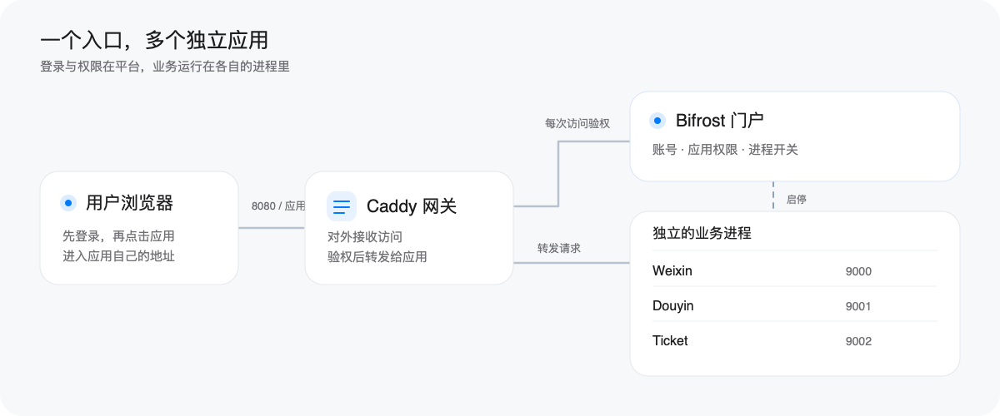
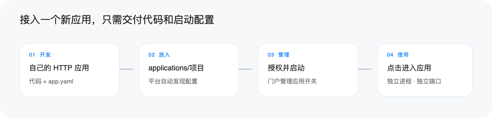

# Bifrost

[](LICENSE)

Bifrost 是多个独立业务应用的统一入口。门户负责账号、应用权限和启停；Caddy 负责鉴权和转发。Ticket、Douyin、Weixin 都通过 `applications/<id>/app.yaml` 接入，各自运行在独立进程、独立访问端口上。同一应用的获授权用户共用业务实例及数据。

## 架构

用户先在门户登录，点击应用后进入该应用自己的地址。三个应用互不占用彼此的页面路径；它们有各自的进程和端口。



**两条线各做一件事：**门户读取配置、管理权限和进程；Caddy 在每次访问应用时向门户确认权限，再把请求交给应用。业务页面、API 和数据都留在应用自身，门户不运行应用代码。图中的端口是当前本机示例，新应用由平台分配端口。

## 应用如何接入



开发者交付正常的 HTTP 应用代码和一份 `app.yaml`，放入 `applications/<id>/`。应用只需接收平台给的 `${PORT}`，在 `127.0.0.1` 上提供普通 HTTP 页面和 API，并在收到 `SIGTERM` 时退出。页面仍使用 `/`、`/api`、`/static` 等正常路径。平台负责登录、授权、分配端口和启停；开发者无需改门户或 Caddyfile，也无需平台 SDK。

最小的 Go 应用配置如下。可运行代码见 [Go 示例](examples/weixin-go/app.yaml)，完整字段和可选的忙闲检查见 [INTEGRATION.md](INTEGRATION.md)。

```yaml
schema: 1
id: weixin
name: 微信应用
build: [go, build, -o, .bifrost/bin/weixin, .]
start: [.bifrost/bin/weixin, --port, "${PORT}"]
```

## 网页打包

管理员打开门户的**应用打包**页面，选择应用和目标系统。已有的预制包或与当前代码匹配的构建缓存可直接下载；没有时，平台按照应用的 `package.yaml` 在后台构建，并显示结果和日志。Weixin 示例已配置 Windows x64 的 `.exe` 和 macOS Apple 芯片的 `.app.zip`（解压得到 `.app`）。Ticket 已配置 macOS Apple 芯片的 Python 独立应用包；Douyin 同时提供 Apple 芯片和 Intel Mac 版本。打包产物保存在应用目录的 `.bifrost/packages/`，业务数据不进入安装包。

打包中心也列出 Android 和 iOS。它们需要应用提供对应的手机端代码、构建配方和构建环境；仅有 HTTP 服务的应用会显示“尚未提供该系统的构建配方”，不会生成不能运行的 APK/IPA。当前 Mac 机器也没有 Windows 原生构建环境、Android SDK 或完整 Xcode；Go 示例的 Windows 构建使用 Go 交叉编译。macOS 示例包尚未做开发者签名与公证，适合本机验证，公开分发前需补齐签名流程。接入打包配方的方法见 [INTEGRATION.md](INTEGRATION.md)。

## 本机启动

```sh
python3 -m venv .venv
.venv/bin/pip install -r requirements.txt
python3.12 -m venv .venv-ticket
.venv-ticket/bin/pip install -r applications/ticket/requirements.txt
python3.12 -m venv .venv-douyin
.venv-douyin/bin/pip install -r applications/douyin/requirements-web.txt
mkdir -p .runtime
chmod 700 .runtime
printf '%s\n' '请换成至少十位的管理员密码' > .runtime/admin-password
chmod 600 .runtime/admin-password
.venv/bin/python portal.py bootstrap-admin admin --password-file .runtime/admin-password
BIFROST_CADDY_CONFIG="$PWD/Caddyfile" PATH="$PWD/.bin:$PATH" .venv/bin/python portal.py
# 另一个终端
PATH="$PWD/.bin:$PATH" caddy run --config Caddyfile
```

门户监听 `127.0.0.1:8790`，Caddy 本机入口为 `http://127.0.0.1:8080`，每个应用的外部端口从 `9000–9999` 分配并显示在管理页。先启动门户，让它生成路由文件，再启动 Caddy；之后管理员刷新管理页会校验并重载新增路由。`BIFROST_CADDY_CONFIG` 要指向正在运行的 Caddyfile，`PATH` 要能找到 Caddy。Ticket 与 Douyin 各用独立 Python 3.12 环境，现有数据目录分别是 `applications/ticket/.runtime_web/` 和 `applications/douyin/datas/web/`，必须保留并备份。

旧的 `/ticket/...` 和 `/douyin/...` GET 链接会跳转到各自的新应用端口；新页面不再使用这些前缀。

## 公网部署

使用 `Caddyfile.public`，设置 `BIFROST_PUBLIC_IP`、`BIFROST_TLS_CERT`、`BIFROST_TLS_KEY`。证书须在 SAN 中包含该 IP。门户进程另设 `BIFROST_PUBLIC_ORIGIN=https://公网IP`、`BIFROST_VERIFY_ORIGIN=https://公网IP:8443` 与 `BIFROST_CADDY_CONFIG=/绝对路径/Caddyfile.public`。防火墙开放 443、8443 和已分配的应用端口；8790、8767、8766 与新应用内部端口仅绑定回环。

Ticket 与 Douyin 的普通页面也使用独立应用端口。Douyin 的官方二次验证另占 `8443`，只允许验证所需路径；更换业务版本时应重新检查这条专用路径。

## 管理和安全

自行注册的账号为待审批。管理员在后台启用账号并分配应用，授权在每次网关请求时检查。禁用、重置密码撤销旧会话；撤权后的下一个请求即被拒绝。管理员重置时输入临时密码，不读取原密码；用户首次登录须先改密。登录最多 12 小时，可选择保持 30 天。门户表单使用 CSRF 令牌和来源检查，应用写请求由内部鉴权再次核对来源。

网关拒绝外部 `/internal/*`，每个应用请求先 `forward_auth` 再转发。所有普通应用都以独立端口转发。网关清除客户端提交的转发/身份提示头，并从上游请求中移除门户会话 Cookie。门户故障时鉴权失败，Caddy 不继续转发。二次验证端口只开放验证专用路径。网关设计依据 [Caddy forward_auth](https://caddyserver.com/docs/caddyfile/directives/forward_auth) 和 [Caddy 路由说明](https://caddyserver.com/docs/caddyfile/directives/handle)。

## 验证

```sh
.venv/bin/python -m unittest discover -s tests -v
```

门户前端已有注册、登录、应用首页、管理后台、个人设置和操作记录页面。自动测试覆盖配置发现、账号授权、服务启停及来源校验。涉及真实账号的扫码、官方二次验证完成及消息发送仍需单独联调。

## 使用许可

**本项目仅供学习、研究、测试及其他非商业用途，不得用于商业目的。** 对本仓库中版权所有者拥有权利的代码，适用 [PolyForm Noncommercial License 1.0.0](LICENSE)；非商业用途下可依该许可证使用、修改和分享。商业使用须事先取得版权所有者的单独授权。

第三方代码、素材和依赖仍受其各自许可证约束，票务应用的依赖说明见 [THIRD_PARTY_NOTICES.md](applications/ticket/THIRD_PARTY_NOTICES.md)。本仓库先前以 MIT 许可证发布的历史版本不受本次许可变更追溯限制。本项目属于**源码可见、限制商用**，不应标为 MIT 或 OSI 意义上的开源许可证。
